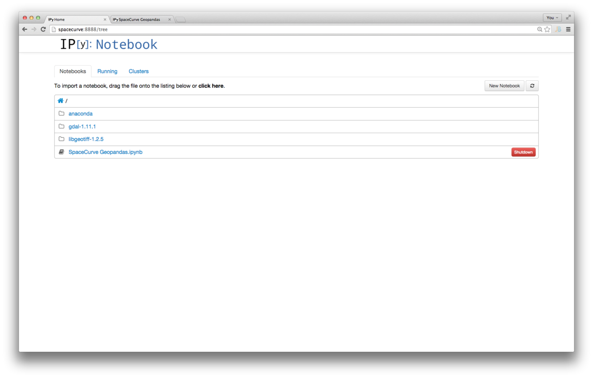
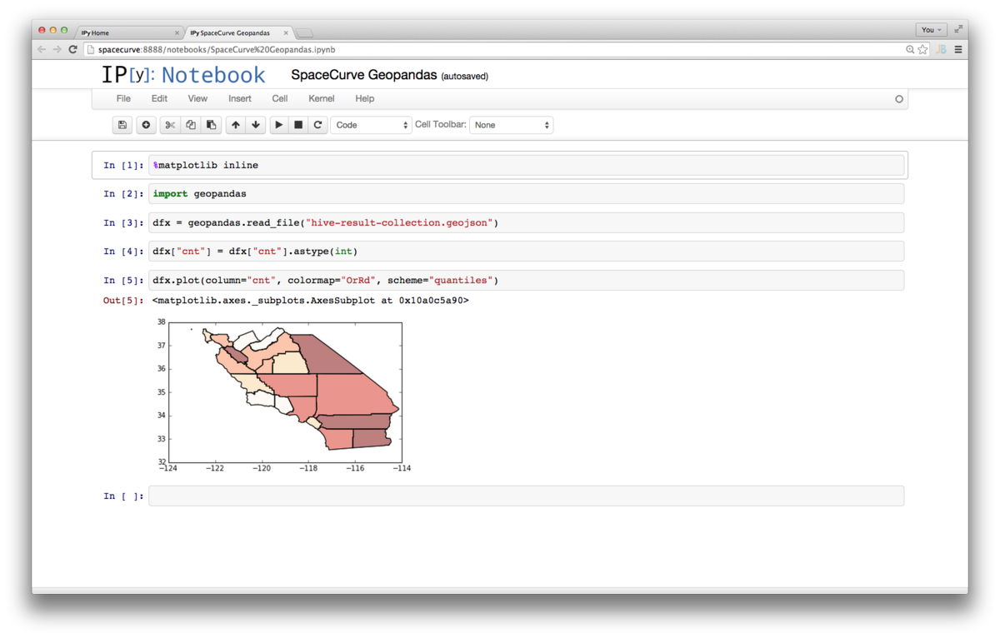

# Installing GeoPandas and IPython Notebook in Centos 6.5

The dependency graph for installing [Matplotlib](http://matplotlib.org/) and
[GeoPandas](http://geopandas.org/) for geospatial visualization requires newer libraries
than what is available in [EPEL](https://fedoraproject.org/wiki/EPEL) (Extra Packages for
Enterprise Linux) on Centos 6.5. To minimize the number of out-of-tree installable
archives we will use the [Anaconda Python
distribution](http://docs.continuum.io/anaconda/) from [Continuum](http://continuum.io/)
which includes [numpy](http://www.numpy.org/)/[scipy](http://www.scipy.org/)/[matplotlib](http://matplotlib.org/)
etc. Only two packages need to be installed on the base system to support GeoPandas
specifically, the rest, including Anaconda, can run from within the user's home directory.

**TK: It should be possible to install `libgeotiff` and `gdal` inside of the Anaconda
directory**

This install guide was created against the SpaceCurve Quickstart VM upgraded to Centos 6.5.

## Archives

We will need three archives before downloading the rest of the packages via [pip](http://en.wikipedia.org/wiki/Pip_(package_manager)).

```
wget http://download.osgeo.org/geotiff/libgeotiff/libgeotiff-1.2.5.tar.gz
wget http://download.osgeo.org/gdal/1.11.1/gdal-1.11.1.tar.gz
wget http://09c8d0b2229f813c1b93-c95ac804525aac4b6dba79b00b39d1d3.r79.cf1.rackcdn.com/Anaconda-2.1.0-Linux-x86_64.sh
```

`sha1sum` of the above files

```
38b10070374636fedfdde328ff1c9f3c6e8e581f  libgeotiff-1.2.5.tar.gz
e2c67481932ec9fb6ec3c0faadc004f715c4eef4  gdal-1.11.1.tar.gz
95d87bd759a529fcdbd8c6ffa961a843031367ce  Anaconda-2.1.0-Linux-x86_64.sh
```

## Install Steps

1. $ `yum groupinstall "Development Tools"` (as root)

    This pulls in gcc,gfortran,make,etc.

2. Create the `geotiff` user account

    This is the user account we will install Anaconda into and run IPython
    Notebook from. Only `libgeotiff` and `gdal` need to be installed into
    the base system. Everything else will be installed with Anaconda and pip
    in the `geotiff` home directory.

        $ adduser geotiff
        $ echo "geotiff:geotiff" | chpasswd
        $ usermod -a -G wheel geotiff


3. $ `echo "/usr/local/lib" >> /etc/ld.so.conf.d/locallib.conf` (as root)

	This allows us to link against the shared libraries that `libgeotiff` and `gdal`
    install into `/usr/local/lib`

    The remained of the steps can be done using the `geotiff` account.

4. Install `libgeotiff`

        # depedency for libgeotiff
        $ sudo yum install libtiff-devel
        $ tar xvf libgeotiff-1.2.5.tar.gz; cd libgeotiff-1.2.5
        $ ./configure; make -j4
        $ sudo make install
        $ sudo ldconfig

5. Install `gdal`

        $ tar xvf gdal-1.11.1.tar.gz; cd gdal-1.11.1
        $ ./configure --with-geotiff=yes; make -j4
        $ sudo make install
        $ sudo ldconfig
   
        
6. Install Anaconda

    	$ bash Anaconda-2.1.0-Linux-x86_64.sh
        # follow the defaults
		# enable Anaconda in your bash_profile

7. Confirm Anaconda works

        # logout; login, pip and python should be in path
        $ which python
        ~/anaconda/bin/python
        $ which pip
        ~/anaconda/bin/pip

8. Install PySAL and GeoPandas

        $ pip install fiona PySAL
        $ pip install geopandas

9. Create ipython notebook server with an open port enabling host to guest communication 

        $ ipython profile create nbserver
        # make the edit
        # c.NotebookApp.ip = ''
        # SECURITY ALERT, anyone on the local net can connect
        # for this demo, we are assumming the VM is running with
        # host only networking
        $ vim ~/.ipython/profile_nbserver/ipython_notebook_config.py

    See [ipython public server](http://ipython.org/ipython-doc/1/interactive/public_server.html)
    for instructions on how to setup passwords and SSL for IPython Notebook.
        
# Launch ipython notebook

[IPython Notebook](http://ipython.org/notebook.html) allows us to have a rich,
interactive Python shell running in the SpaceCurve Quickstart VM accessible via
a browser on our host OS.

Launch the IPython server on the SpaceCurve VM with:

`$ ipython notebook --profile=nbserver`

You should see:

```
2014-10-05 12:34:27.820 [NotebookApp] Using existing profile dir: u'/home/geotiff/.ipython/profile_nbserver'
2014-10-05 12:34:27.827 [NotebookApp] Using MathJax from CDN: https://cdn.mathjax.org/mathjax/latest/MathJax.js
2014-10-05 12:34:27.841 [NotebookApp] CRITICAL | WARNING: The notebook server is listening on all IP addresses and not using encryption. This is not recommended.
2014-10-05 12:34:27.841 [NotebookApp] CRITICAL | WARNING: The notebook server is listening on all IP addresses and not using authentication. This is highly insecure and not recommended.
2014-10-05 12:34:27.842 [NotebookApp] Serving notebooks from local directory: /home/geotiff
2014-10-05 12:34:27.842 [NotebookApp] 0 active kernels 
2014-10-05 12:34:27.842 [NotebookApp] The IPython Notebook is running at: http://[all ip addresses on your system]:8888/
2014-10-05 12:34:27.842 [NotebookApp] Use Control-C to stop this server and shut down all kernels (twice to skip confirmation).
2014-10-05 12:34:27.843 [NotebookApp] WARNING | No web browser found: could not locate runnable browser.
```

Copy the IPython notebook and the example [GeoJSON](http://en.wikipedia.org/wiki/GeoJSON) that is in this directory over to the SpaceCurve VM

`scp SpaceCurve\ Geopandas.ipynb hive-result-collection.geojson geotiff@spacecurve:`

On the host machine navigate to http://spacecurve:8888/ and open the `SpaceCurve Geopandas.ipynb` by clicking on it in the browser.



When the notebook is loaded the code will run and the data will be plotted inline.



You can copy and paste the entire block of code below into a single IPython Notebook cell and execute it via `shift-enter`. The
[IPython reference](http://ipython.org/ipython-doc/2/interactive/reference.html) explains full keyboard usage of the shell.

```python
%matplotlib inline
import geopandas
dfx = geopandas.read_file("hive-result-collection.geojson")
dfx["cnt"] = dfx["cnt"].astype(int) 
dfx.plot(column="cnt", colormap="OrRd", scheme="quantiles")
```


